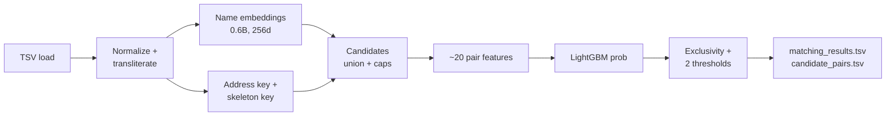

# Amazon ML Challenge 2026 — Entity Resolution Guidebook v2

Sep 25, 2026 · @Nikhil

## Overview: what changed and the final architecture

Final plan: one g5.2xlarge machine, name-only embeddings from Qwen3-Embedding-0.6B, three blocking channels, LightGBM on \~20 features, and a decision layer on top (exclusivity + two thresholds). The first valid submission must happen before the end of Day 1.

| Area | v1 playbook | v2 (this guide) | Why |
| --- | --- | --- | --- |
| Compute | HPCF + 3 AWS accounts, 6 GPUs | 1 AWS account, 1 x g5.2xlarge (8 vCPU, 32 GB RAM, A10G 24 GB) | Fits the 8 vCPU quota; removes sharding and S3 overhead |
| Embedding model | Qwen3-Embedding-8B | Qwen3-Embedding-0.6B, 256 dims, fp16 | \~1.5 crore texts; 8B is \~10x slower |
| What to embed | name + address combined | normalized name only | Short text = fast encoding; address handled by features |
| ANN search | FAISS | torch matmul + topk on GPU | No extra install; 5M x 256 fp16 fits on the GPU |
| Blocking | embedding + token overlap | 3 channels: name embedding, address key, name-skeleton key | Recall for generic names and cross-script cases |
| Multilingual | missing | anyascii transliteration + consonant skeleton | S2/S3 contain Devanagari, Tamil, Telugu, Kannada, Gujarati, Bengali names |
| Classifier | LightGBM, class\_weight balanced | LightGBM, no class weight | Probabilities must stay calibrated |
| Decision | one global threshold | exclusivity + t\_top1 + t\_extra | Top-1 and extra matches have different trade-offs |
| Country | open set | open set, country is not a model feature | France is absent from train |

Data sizes: test S1 \~17 lakh, test S2+S3 \~50 lakh, train S1 \~22 lakh; assume train S2+S3 is of similar size.



Every stage saves its output to disk (the cache/ folder), so a crash or bug only requires rerunning that stage.

Two facts about the metric drive every decision:

- Giving a top-1 match vs leaving the list empty: the outcome is 0 or 1 either way. So `t_top1` stays moderate, and can go lower since singletons are rare.
- Adding an extra match: one wrong extra drops a 5-match entity's score from 0.952 to 0.80, while one correct extra adds only 0.048. So `t_extra` stays high.

## Step 0: AWS setup from scratch (\~30 min)

You need exactly one machine: g5.2xlarge in the us-east-1 region. Your G and VT quota is 8 vCPU, and g5.2xlarge uses exactly 8 vCPU. Cost is \~$1.21/hr, so $100 buys \~80 hours (confirm the price on the launch page).

**0.1 Launch the instance**

1. Open the AWS Console and select **US East (N. Virginia) us-east-1** from the top-right region menu.
2. Go to EC2, then **Launch instance**.
3. Name: `amlc-2026`.
4. AMI: type `Deep Learning` in the search box. Choose **Deep Learning OSS Nvidia Driver AMI GPU PyTorch (Ubuntu 22.04)**, or the latest PyTorch + Ubuntu DLAMI shown. It comes with the NVIDIA driver, CUDA and PyTorch preinstalled.
5. Instance type: **g5.2xlarge**.
6. Key pair: **Create new key pair**, name `amlc-key`, type RSA, format `.pem`. The file downloads once; keep it safe, it cannot be downloaded again.
7. Network settings: under "Allow SSH traffic from", choose **My IP**.
8. Storage: root volume **200 GiB, gp3**. The default 8 GB cannot hold the data and model.
9. Click **Launch instance**, then wait in the Instances list until status is "Running" and checks show "2/2 passed" (2-5 min).
10. Click the instance and copy its **Public IPv4 address**.

If launch fails with "vCPU limit exceeded", another G instance is running. Stop or terminate it.

**0.2 Connect from your laptop**

In a Mac/Linux terminal (the same works in Windows PowerShell):

```bash
chmod 400 ~/Downloads/amlc-key.pem
ssh -i ~/Downloads/amlc-key.pem ubuntu@<PUBLIC_IP>
```

If asked "Are you sure you want to continue connecting", type `yes`. The DLAMI login message shows how to activate the PyTorch environment; note that command.

**0.3 tmux: run every long job inside it**

```bash
tmux new -s amlc        # new session
# run your job, then detach: Ctrl+b, then d
tmux attach -t amlc     # to come back
```

If the WiFi or SSH connection drops, jobs inside tmux keep running.

**0.4 GPU check**

```bash
nvidia-smi
python3 -c "import torch; print(torch.cuda.is_available(), torch.cuda.get_device_name(0))"
```

If the second line prints `True NVIDIA A10G`, the setup is fine.

**0.5 Rules to save money**

- When you are not working, go to EC2, then Instance state, then **Stop**. **Never Terminate**, or all data on the disk is lost.
- After Stop and Start, the Public IP changes. Copy the new IP before SSH.
- A stopped instance is charged only for the disk (\~$2 for 200 GB over 3 days).
- Optional: set an $80 alert under Billing, then Budgets.

**0.6 Moving files between laptop and EC2**

```bash
# laptop to EC2
scp -i ~/Downloads/amlc-key.pem dataset.zip ubuntu@<PUBLIC_IP>:~/
# EC2 to laptop (bring outputs back)
scp -i ~/Downloads/amlc-key.pem ubuntu@<PUBLIC_IP>:~/student_resource/output/matching_results.tsv .
```

If the portal gives a direct dataset download link, run `wget "<link>"` on EC2 itself. That is faster than uploading from the laptop.

## Step 1: Environment, libraries, model download (\~30 min)

Workflow rule: write code on the laptop in Antigravity and debug it on a 50k-row sample. Run the full data only on EC2. Sync code through a private GitHub repo: `git push` from the laptop, `git pull` on EC2.

**1.1 Libraries**

| Library | Purpose | License |
| --- | --- | --- |
| pandas, pyarrow | TSV loading, parquet cache | BSD / Apache 2.0 |
| numpy | arrays, embeddings | BSD |
| anyascii | transliterate every script to Latin | ISC |
| rapidfuzz | fuzzy string features (fast C++) | MIT |
| scikit-learn | TF-IDF, splits, utilities | BSD |
| lightgbm | pairwise classifier | MIT |
| sentence-transformers, transformers | load and encode Qwen3-Embedding | Apache 2.0 |
| torch | GPU inference + matmul search | BSD |
| tqdm | progress bars | MIT / MPL |

FAISS is not needed: torch matmul + topk on the GPU does the search.

**1.2 Install on EC2**

First activate the DLAMI PyTorch environment (the command from the login message), then:

```bash
pip install -U pip
pip install pandas pyarrow numpy tqdm scikit-learn rapidfuzz lightgbm anyascii
pip install "transformers>=4.51" "sentence-transformers>=3.0"
python3 -c "import torch, transformers, sentence_transformers, lightgbm, rapidfuzz, anyascii; print('ok')"
```

Qwen3 models need transformers 4.51 or newer. Older versions fail with "KeyError: qwen3".

**1.3 Install on the laptop**

```bash
python3 -m venv amlc_env
source amlc_env/bin/activate        # Windows: amlc_env\Scripts\activate
pip install pandas pyarrow numpy tqdm scikit-learn rapidfuzz lightgbm anyascii torch "transformers>=4.51" "sentence-transformers>=3.0"
```

On the laptop, embeddings run on CPU. 50k names can take 10-15 min, so use it only on the sample.

**1.4 Model download (on EC2, once)**

The model comes from Hugging Face: `Qwen/Qwen3-Embedding-0.6B` (Apache 2.0, \~0.6B params, within the rule). Downloading model weights is not external data lookup, but mention it in the documentation.

```bash
pip install -U huggingface_hub
huggingface-cli download Qwen/Qwen3-Embedding-0.6B
```

The weights are cached in `~/.cache/huggingface/`. After that, the code loads them with `SentenceTransformer("Qwen/Qwen3-Embedding-0.6B")` without internet.

**1.5 Folder structure**

```
student_resource/
  dataset/train/   train_source1.tsv, train_source2.tsv, train_source3.tsv, train_ground_truth.tsv
  dataset/test/    test_source1.tsv, test_source2.tsv, test_source3.tsv
  utils/validate_submission.py
  cache/           parquet and npy intermediate files
  output/          matching_results.tsv, candidate_pairs.tsv
  code/business_entity_resolution/
    src/
      config.py        paths, SAMPLE flag, k values, thresholds
      metrics.py       macro F0.5
      s0_eda.py
      s1_normalize.py
      s2_embed.py
      s3_block.py
      s4_features.py
      s5_train.py
      s6_tune.py
      s7_predict.py
      s8_write.py
      run_all.sh
    README.md
    requirements.txt
  Documentation_template.md
  make_zip.sh
```

Keep a `SAMPLE` flag in `config.py`. With `SAMPLE=50000`, every script uses only the first 50k S1 entities (plus their GT matches and random S2/S3 records), so the full pipeline runs on the laptop in 5-10 min. On EC2, set `SAMPLE=None`.

## Step 2: Data loading and EDA (s0\_eda.py, \~1 hr)

The EDA numbers decide k, the starting threshold ranges and the exclusivity rule. Do not skip it.

**2.1 Loading rule**

Load every TSV with `pd.read_csv(path, sep="\t", dtype=str, keep_default_na=False, quoting=3)`:

- `dtype=str` keeps IDs and PIN codes as strings (leading zeros are not lost).
- `keep_default_na=False` keeps empty cells as `""`, not NaN.
- `quoting=3` (QUOTE\_NONE) stops `"` inside addresses from breaking parsing.

Right after loading, save every file to `cache/*.parquet`. Loading from parquet next time is many times faster than TSV.

Split the GT `matched_entity_ids` column on commas and convert it to long format: one row = (s1\_id, match\_id, source). This is the base for training labels.

**2.2 Compute and record these numbers**

| Check | Why it matters |
| --- | --- |
| Rows per file, by country | Memory and time planning |
| Singleton % (train S1 with empty GT), by country | Starting range for t\_top1 |
| Distribution of matches per S1, S2 and S3 separately (mean, 95th percentile, max) | Blocking k per source |
| Does any S2/S3 ID appear in more than one GT row? | Whether the exclusivity rule is safe |
| Is an S1 ever matched to a record from a different country? | Whether country-wise blocking is safe |
| % of non-ASCII records per source | How much transliteration matters |
| % empty or "null" addresses per source | addr\_missing feature |
| How many train S2/S3 records match no S1 at all | How many distractors the pool has |

If the exclusivity check finds duplicates (one S2 matched to two S1s), do not apply the Step 8 exclusivity rule, or apply it only to strong-margin cases.

If cross-country matches are 0, block within country. If there are some, do not use country as a blocking key; use it only as a feature (same\_country flag).

**2.3 Validation split**

Split train S1 IDs randomly 80/20 (fixed seed, e.g. 42). The full S2/S3 pool stays in both. For speed:

- Sample 3 lakh S1 from the train fold (for model training).
- Sample 1 lakh S1 from the val fold (for threshold tuning and scoring).
- Search for both samples always runs against the full train S2/S3 pool.

Save these IDs to `cache/split.parquet`, so every experiment uses the same split.

**2.4 Proxy check for France**

Keep one extra run: train on US, validate on India, and the reverse. If the score drops a lot, the model is overfitting to country-specific patterns and will drop on France too.

## Step 3: Normalization and transliteration (s1\_normalize.py, \~2 hr to write, \~20 min to run)

Build the normalized columns once per record and save them to `cache/norm_<split>_<source>.parquet`. All later stages use only these columns. Keep the raw columns alongside.

**3.1 Transliteration (the very first step)**

- Run `anyascii()` only on strings that contain a non-ASCII character (`not s.isascii()`). All other strings pass through unchanged, which saves a lot of time.
- Accented French letters (é, à, è) also become plain here.
- First run the 200-pair test (non-Latin S2/S3 names in train GT vs their Latin S1 names). If `indic-transliteration` scores clearly better, use it only for Indic scripts. Otherwise keep anyascii.

**3.2 Name normalization, in this order**

1. Lowercase.
2. Handle URLs: remove `www.` and `.com/.in/.org/.net/.fr`. Keep "wilfordhancock.com" as "wilfordhancock". If a URL follows a `|`, drop it.
3. DBA split: if " dba " is present, keep two versions of the name (`name_a`, `name_b`). Features take the max similarity over both.
4. Remove trailing IDs: codes of 4+ digits at the end, such as `#98825`, `- 2067865001`.
5. Replace punctuation with a space; turn `&` into "and". Junk prefixes (`--`, `<<`, `#`) disappear here.
6. Word-level abbreviation map (whole tokens only, never substrings): pvt=private, ltd=limited, corp=corporation, co=company, inc=incorporated, llc, llp, pc, pllc, lp, intl=international, mfg=manufacturing, svcs=services, assoc=associates, bros=brothers, cie=compagnie, ste=societe, grp=groupe.
7. Collapse consecutive repeated tokens: "crestline crestline" to "crestline", "pvt pvt" to "pvt".
8. Extract legal suffix tokens separately. The set: private, limited, incorporated, llc, llp, lp, pc, pllc, corporation, company, sarl, sas, sasu, sa, sci, eurl, snc, public, m/s. Remove them from any position in the name (both "llc moncada" and "moncada llc") and store them in a separate `legal` column. What remains is `core_name`.
9. Remove weak tokens like "(india)", "shri", "the" from core\_name, but keep them in `name_full`.

Output columns: `name_full`, `core_name`, `legal`, `core_sorted` (tokens sorted), `name_skel`.

**3.3 Consonant skeleton**

Rule for `name_skel`: remove vowels (a, e, i, o, u, y) from each core\_name token, then collapse consecutive repeated letters. Keep the first letter if it is a vowel. "ram marketing" and the transliterated "raama maarketinga" both become "rm mrktng".

Digit-leet fix, only in the skeleton path: inside a token, map 5 to s, 0 to o, 1 to l, 3 to e ("5uperior" = "superior"). Leave standalone numbers untouched.

**3.4 Address normalization**

1. Transliterate, lowercase; treat the literal "null" and empty strings as empty.
2. Replace punctuation with a space, but keep a separate raw copy for house numbers with `/` and `-` (16-11-23/37/a).
3. Abbreviation map (whole tokens): rd=road, st=street, ave/av=avenue, blvd/bd=boulevard, dr=drive, ln=lane, ct=court, hwy=highway, apt=apartment, fl=floor, no=number, opp=opposite, nr=near, bldg=building, r=rue, pl=place, chs=society.
4. Remove noise tokens: numbers that come with po box, pmb, unit, suite, floor go into a separate `unit_tokens` column and are removed from the main address.
5. State map: US full state names to 2-letter codes (texas to tx); Indian state names and abbreviations to one canonical code (maharashtra/mh to mh, delhi/dl to dl, telangana/tg/ts to tg). Native-script state names are caught by this map after transliteration; add 2-3 roman spellings per state for variants.

Output columns: `addr_norm`, `addr_tokens`, `house_no`, `num_tokens`, `zip_pin`, `state_code`, `addr_missing`.

**3.5 Number extraction rules**

- `house_no`: the first number token in the address. Strip leading zeros ("0200" to "200"). If masked like "##8", keep only the digits ("8") and set a `house_masked=1` flag.
- `num_tokens`: the set of all numbers in the address, without leading zeros.
- `zip_pin`: a 5-digit number near the end for the US; a 6-digit PIN for India; a 5-digit postal code for France. Keep the pattern generic; do not hardcode by country.

**3.6 What must not go wrong**

- Replacements always happen at token level. Turning "st" into "street" must not change "stone" or "west".
- The normalization function must be country-agnostic. Do not write country-based if-else; apply all maps to all records.

## Step 4: Name embeddings (s2\_embed.py, GPU, \~1-3 hr in background)

Embed only the normalized `name_full`, 256 dims, fp16. Run encoding in the background inside tmux, and write the Step 5-6 code on CPU meanwhile.

**4.1 Load the model and encode**

```python
import torch, numpy as np
from sentence_transformers import SentenceTransformer

model = SentenceTransformer(
    "Qwen/Qwen3-Embedding-0.6B",
    device="cuda",
    model_kwargs={"torch_dtype": torch.float16},
    truncate_dim=256,              # MRL truncation
)

def embed(texts, batch_size=512):
    v = model.encode(texts, batch_size=batch_size, convert_to_numpy=True,
                     normalize_embeddings=False, show_progress_bar=True)
    v = v / np.linalg.norm(v, axis=1, keepdims=True).clip(1e-6)   # normalize after truncation
    return v.astype(np.float16)
```

Both sides are the same kind of text (name vs name), so do not add any query prompt or instruction.

**4.2 Speed tricks**

- **Encode unique names only.** Normalized names have many duplicates ("global applied", "summit inc"). Encode `unique()` values and map back by index. The saving can be large.
- Time the first 50k names and record texts/sec. Estimate the total time from that.
- On out-of-memory, drop batch\_size to 256.

**4.3 Encoding order**

1. Train sample S1 (3 lakh train + 1 lakh val).
2. Full train S2 and S3 pool. Training can start after this.
3. Test S1, S2, S3. Start this while you work on features and the model.

**4.4 Save format**

For each file, `cache/emb_<split>_<source>.npy` (float16, shape N x 256) and `cache/ids_<split>_<source>.npy` (entity\_ids in the same order). Never let the order mismatch: row i of the embeddings must always match row i of the ids.

Memory: 50 lakh x 256 x 2 bytes = \~2.5 GB. This fits easily in both RAM and GPU.

**4.5 Day 2 option: fine-tuning**

If the baseline works by Day 2 and recall@k looks low, fine-tune the 0.6B model for 1 epoch on train GT pairs with a contrastive loss (MultipleNegativesRankingLoss). This raises blocking recall. It is optional; baseline first.

## Step 5: Blocking with three channels (s3\_block.py, \~1 hr)

Candidates = the union of three channels. Each S1 gets candidates from S2 and S3 separately. This stage's output is the model's input, and on test it becomes `candidate_pairs.tsv`.

**5.1 Channel A: name embedding search (GPU)**

Build a separate index per (country, source), e.g. (India, S2), (India, S3), (US, S2)... Take the country list from the data (`df.country.unique()`); do not hardcode it. If EDA found cross-country matches, do not split by country.

```python
import torch

def topk_search(q_emb, x_emb, k, chunk=20000):
    X = torch.from_numpy(x_emb).cuda()             # N x 256, fp16
    all_s, all_i = [], []
    for i in range(0, len(q_emb), chunk):
        Q = torch.from_numpy(q_emb[i:i+chunk]).cuda()
        s, idx = torch.topk(Q @ X.T, k=min(k, X.shape[0]), dim=1)
        all_s.append(s.float().cpu()); all_i.append(idx.cpu())
    return torch.cat(all_s).numpy(), torch.cat(all_i).numpy()
```

Starting k: 15 per source. The final k is set by recall@k in Step 5.4. Save `emb_score` and `emb_rank` with every candidate; they become features.

**5.2 Channel B: address key (CPU hash join)**

Build 2 keys per record (whichever are available):

- `(country, house_no, street_token)`: street\_token = the first alphabetic token after house\_no that has 4+ letters and is not a state/city/stopword.
- `(country, zip_pin, house_no)`.

Join S1 keys to S2/S3 keys with a pandas `merge`. Drop any key shared by more than 50 records (too generic; candidates would blow up). Keep at most 20 candidates per S1.

**5.3 Channel C: name skeleton key (CPU hash join)**

Key = `(country, sorted tokens of name_skel)`. It catches cross-script and typo near-exact matches that embeddings can miss. Here too, drop blocks larger than 50 and keep at most 20 per S1.

**5.4 Union, caps and recall check**

1. Union the three channels' candidates on `(s1_id, cand_id)`. Keep flags on each pair: `ch_emb`, `ch_addr`, `ch_skel`.
2. For pairs that did not come from channel A, compute `emb_score` later directly as a dot product, so every pair has this feature.
3. Cap total candidates per S1 (start at 40), keeping the top by emb\_score.
4. Measure on the val sample and fill this table:

| Metric | Target |
| --- | --- |
| Pair recall (GT pairs found in candidates / total GT pairs) | 97% or higher |
| Entity level: % of S1 whose all matches are in candidates | as high as possible |
| Avg candidates per S1 | under 40 |
| Unique contribution per channel | Drop any channel that adds nothing |

If recall is below 97%, first raise k (20, 30), then revisit the address key rules. Print 30 examples of missed GT pairs; they will show the next fix.

**5.5 Save**

`cache/cands_<split>.parquet` columns: `s1_id, cand_id, cand_source, emb_score, emb_rank, ch_emb, ch_addr, ch_skel`. For train/val, also a `label` column (1 if in GT, else 0).

On test, process all S1 in chunks of 1-2 lakh and save each chunk to its own file. After a crash, only the remaining chunks need to run.

## Step 6: Pairwise features (s4\_features.py, CPU, chunked)

Keep \~20 features in v1. Add new features only after the first submission, and test each new feature on val F0.5.

**6.1 Speed rule**

Do not write row-wise Python loops. rapidfuzz's `process.cpdist(list_a, list_b, scorer=..., workers=-1)` scores all pairs of two equal-length lists at once and uses all 8 cores. Each feature should be one vectorized call. Process S1 in chunks of 1-2 lakh and save each chunk's features to parquet.

**6.2 Feature list**

| Group | Feature | How |
| --- | --- | --- |
| Name | emb\_score, emb\_rank | from Step 5 |
| Name | name\_token\_sort | cpdist, fuzz.token\_sort\_ratio on name\_full |
| Name | name\_token\_set | fuzz.token\_set\_ratio on name\_full |
| Name | core\_ratio | fuzz.ratio on core\_name (without legal suffix) |
| Name | core\_partial | fuzz.partial\_ratio on core\_name |
| Name | skel\_ratio | fuzz.ratio on name\_skel |
| Name | name\_jaccard | Jaccard of token sets |
| Name | legal\_match | same legal suffix = 1, different = 0, one missing = -1 |
| Name | dba\_max | for DBA records, max token\_sort over both name versions |
| Name | len\_diff | absolute difference in core\_name lengths |
| Address | addr\_token\_set | fuzz.token\_set\_ratio on addr\_norm |
| Address | house\_match | 1 same, 0 different, -1 missing on either side |
| Address | num\_jaccard | Jaccard of num\_tokens |
| Address | zip\_match | 1 / 0 / -1 |
| Address | state\_match | 1 / 0 / -1 |
| Address | addr\_missing\_any | address empty on either side |
| Context | cand\_source | S2 = 0, S3 = 1 |
| Context | ch\_emb, ch\_addr, ch\_skel | which channel produced it |
| Context | gap\_to\_best | this S1's best emb\_score minus this candidate's emb\_score |
| Context | n\_cands | total candidates for this S1 |
| Context | reverse\_rank | for this candidate, the rank of this S1's emb\_score among all S1s whose lists contain it |
| Context | support | this candidate's max name similarity to the other top-5 candidates of the same S1 |

**6.3 Rules for context features**

- `reverse_rank` is global: compute it with groupby(cand\_id) over the whole candidate table, before chunking.
- For `support`, take dot products between the embeddings of the same S1's candidates (candidate embeddings already exist). In multi-match entities, this lets correct matches support each other.
- **Do not make country a feature.** France is absent from train, so a country feature gives a wrong signal on test.

**6.4 Output**

`cache/feats_<split>_<chunk>.parquet`: `s1_id, cand_id, label (train/val), feature columns`. Fix the feature column names and order as a list in `config.py`, so train and test use exactly the same order.

## Step 7: LightGBM training and metric (s5\_train.py, metrics.py, \~20 min per run)

Train LightGBM on the candidate pairs of the 3 lakh train-fold S1, and score on the 1 lakh val-fold S1. No class weights.

**7.1 Metric function (metrics.py)**

Per-S1 score, following the official rules:

```latex
F_{0.5} = \frac{1.25 \cdot P \cdot R}{0.25 \cdot P + R}
```

```python
def f05_entity(pred: set, gold: set) -> float:
    if not gold:                       # true singleton
        return 1.0 if not pred else 0.0
    if not pred:                       # had matches, predicted nothing
        return 0.0
    tp = len(pred & gold)
    if tp == 0:
        return 0.0
    p, r = tp / len(pred), tp / len(gold)
    return 1.25 * p * r / (0.25 * p + r)

def macro_f05(pred_map: dict, gold_map: dict) -> float:
    # gold_map must contain every eval S1, including empty sets
    return sum(f05_entity(pred_map.get(s, set()), g) for s, g in gold_map.items()) / len(gold_map)
```

Sanity test: the official example (3 predicted IDs, 2 gold, both gold IDs in pred) must give 0.714.

Use the full GT as the gold set, not just the pairs inside candidates. Otherwise matches missed by blocking never show up in the score, and the val score will be falsely high.

**7.2 LightGBM settings (starting point)**

| Param | Value |
| --- | --- |
| objective | binary |
| learning\_rate | 0.05 |
| num\_leaves | 63 |
| min\_child\_samples | 100 |
| feature\_fraction | 0.8 |
| bagging\_fraction, bagging\_freq | 0.8, 1 |
| n\_estimators | 2000, early stopping 100 rounds on val logloss |
| class\_weight / is\_unbalance | do not set |
| n\_jobs | 8 |

After training, save to `cache/model_vN.txt` (`booster.save_model`) and print feature importance. Features with \~0 importance can be dropped in the next version.

**7.3 Log every experiment**

Keep an `experiments.md` file. Write one line per run:

| Version | What changed | Recall@cands | Val AUC | Val macro F0.5 | t\_top1 / t\_extra |
| --- | --- | --- | --- | --- | --- |
| v1 | baseline |  |  |  |  |

This log later doubles as the documentation and the version history.

**7.4 France proxy run**

Once, train on US-only data and score on India val, and the reverse. If the score drops a lot because of some feature (a country-specific pattern), remove it or make it generic.

## Step 8: Decision layer (s6\_tune.py, \~10 min)

The score is made here. Three rules apply to the model's probabilities, in this order: exclusivity, the top-1 rule, the extra rule. All their parameters are tuned on val macro F0.5.

**8.1 Exclusivity (only if confirmed in Step 2)**

For every `cand_id` (S2/S3 record) that appears in more than one S1's list, keep it only for the S1 where its probability is highest. Set that pair's probability to 0 for all other S1s. This is a one-liner with `groupby(cand_id)` + `idxmax`.

Optional: keep a margin `m`. If the gap between the top and second S1's probability is below `m`, remove the record from both (ambiguous). Test `m` at 0, 0.05, 0.1.

**8.2 Per-S1 selection**

1. Sort each S1's candidates by probability.
2. If the top-1 probability is below `t_top1`, output an empty list (singleton prediction).
3. Otherwise keep the top-1, plus every other candidate whose probability is above `t_extra`.

**8.3 Grid search**

| Param | Range | Step |
| --- | --- | --- |
| t\_top1 | 0.20 to 0.80 | 0.02 |
| t\_extra | 0.40 to 0.95 | 0.02 |
| m (exclusivity margin) | 0, 0.05, 0.10 | - |

Compute val macro F0.5 for every combination and save the best combo in `config.py`. The grid is small; it takes a few minutes on 8 cores.

**8.4 After tuning, check these slices**

| Slice | What to check |
| --- | --- |
| True singletons | % predicted empty |
| Entities with 1 match | How often top-1 is correct |
| Entities with 3+ matches | Average recall, wrong extras |
| By country (US, India) | No single country is much worse |
| cand\_source (S2 vs S3) | No over-merging on one source |

Print and read the worst 30 false merges and 30 misses. The next feature or normalization fix comes from there.

**8.5 One warning**

On val, exclusivity only sees competition among 1 lakh S1, whereas on test 17 lakh S1 will compete. So on test, exclusivity will remove somewhat more records than on val. That is normal. For the same reason, do not push the margin `m` above 0 unless val shows a clear gain.

## Step 9: Test inference and output files (s7\_predict.py, s8\_write.py, \~2-4 hr)

Test runs exactly the same pipeline: same normalization, same k and caps, same feature list, same model file, same thresholds. Nothing is fitted or tuned on test.

**9.1 Order**

1. Normalize test S1, S2, S3 (Step 3).
2. Test embeddings (Step 4), if not already done.
3. Blocking (Step 5) in S1 chunks, saving each chunk.
4. `reverse_rank` over the whole candidate table (global).
5. Features (Step 6) and LightGBM predict, chunk-wise. Save each chunk's probabilities.
6. Merge all probabilities, then apply exclusivity and thresholds (Step 8) at the global level.

**9.2 Writing the outputs (s8\_write.py)**

- Keep the row order of test\_source1.tsv, with a row for **every** S1. If an S1 has no candidates or matches, its row holds only the ID and a tab, with an empty list.
- `matching_results.tsv` header: `source1_entity_id<TAB>matched_entity_ids`.
- `candidate_pairs.tsv` header: `source1_entity_id<TAB>candidate_entity_ids`. It must contain exactly the pairs the model predicted on (the list after the Step 5.4 caps).
- Join ID lists with commas, no spaces, no quotes. Remove duplicates within each list (`dict.fromkeys`).
- Every matched ID must also be in its candidate list.
- Write with `encoding="utf-8"` and `\n` line endings.

**9.3 Validator (before every submission)**

```bash
cd ~/student_resource
python3 utils/validate_submission.py \
  --matching output/matching_results.tsv \
  --candidate output/candidate_pairs.tsv \
  --test-dir dataset/test
```

Upload only after `PASS`. Before the final submission, run it once with `--check-ids` too. It should fit in 32 GB RAM; if it runs out of memory, drop `--candidate`.

**9.4 Your own sanity checks**

| Check | Expected |
| --- | --- |
| Rows in matching\_results = rows in test\_source1 | Equal |
| % empty rows | Close to the EDA singleton % |
| Avg matches per non-empty row | Slightly below the train GT average (precision-first) |
| Empty % by country (France too) | If France's empty % is much higher than US/India, France has a recall problem |

If France's empty % is much higher, print some France rows. Usually a French pattern (rue, avenue, sarl) was missed in normalization.

## Step 10: Submission, packaging and documentation

The portal asks for both matching\_results.tsv and a code zip with every submission. So have the zip script ready on Day 1, so every submission takes one command.

**10.1 make\_zip.sh**

```bash
#!/bin/bash
# usage: ./make_zip.sh <team_name>
set -e
TEAM=$1
rm -rf pkg && mkdir -p pkg/output pkg/code
cp output/matching_results.tsv output/candidate_pairs.tsv pkg/output/
cp -r code/business_entity_resolution pkg/code/
find pkg/code -name "__pycache__" -prune -exec rm -rf {} +
cp Documentation_template.md pkg/
cd pkg && zip -r ../${TEAM}_submission.zip . && cd ..
ls -lh ${TEAM}_submission.zip
```

Do not put `cache/`, `dataset/` or model weights in the zip; the size would explode. If candidate\_pairs.tsv is too large and the portal rejects the upload, send only `code/` and the doc in the portal code zip, and the full package in the final submission.

**10.2 requirements.txt and README.md**

- On EC2, run `pip freeze | grep -iE "pandas|pyarrow|numpy|anyascii|rapidfuzz|scikit-learn|lightgbm|sentence-transformers|transformers|torch|tqdm" > requirements.txt`.
- In the README, write: Python version, `pip install -r requirements.txt`, the model download command (Step 1.4), where to put the data (Step 1.5), and one command `bash src/run_all.sh` that runs all scripts s0 to s8 in order. Also note each script's expected time.
- Every function needs a one-to-two-line comment on top: what it takes in and what it returns. The guidelines require this.

**10.3 Filling in Documentation\_template.md**

| Template section | What to write (from this guide) |
| --- | --- |
| 1. Executive Summary | 3-channel blocking + LightGBM + F0.5-aware decision layer |
| 2.1 Problem Analysis | Step 2 EDA numbers, multilingual scripts, noise patterns |
| 2.2 Solution Strategy | Blocking + Classifier; core innovation: transliteration + skeleton + exclusivity + two thresholds |
| 3. Candidate Generation | Step 5 channels, k, caps, recall table, total candidate pairs |
| 4. Matching Model | Step 6 feature table, LightGBM params, threshold grid search |
| 5. Results & Error Analysis | Best val F0.5 from experiments.md, Step 8.4 slices, typical false merges and misses |
| 6. Conclusion | 2-3 lines |
| Appendix A | Folder structure and run\_all.sh |

Also state clearly: no external API, geocoding or internet lookup was used; the models are Qwen3-Embedding-0.6B (Apache 2.0, 0.6B params) and LightGBM (MIT); transliteration used an offline library (anyascii, ISC).

**10.4 Upload**

1. Validator PASS.
2. `./make_zip.sh <team_name>`.
3. On the portal, matching\_results.tsv under "Upload Matching Results File", the zip under "Upload Code File".
4. "Submit & Evaluate", then note the SCORED status and F0.5.
5. Record the version, val score and public LB score in experiments.md. Keep a copy of the zip in `submissions/vN/` (version history).

## Timeline, submission plan, compliance

The deadline is 27 Sept 2026, 11:59 PM IST. The first valid submission must be in by Day 1 night, and the final package ready by 8 PM on Day 3.

**Timeline**

| When | Work | Done means |
| --- | --- | --- |
| Day 1, morning | Step 0-1: EC2, install, model download; data on EC2 | nvidia-smi OK, model loads |
| Day 1, afternoon | Step 2 EDA + Step 3 normalization; embeddings start in background | EDA table filled, norm parquet ready |
| Day 1, evening | Steps 5-8 on the laptop sample, then on the full train sample | First val macro F0.5 number |
| Day 1, night | Steps 9-10 on test | Submission 1 SCORED |
| Day 2 | Recall fixes (k, address key), features from error analysis, France proxy run, optional embedding fine-tune | Every change logged in experiments.md, 2-3 submissions |
| Day 3, morning-afternoon | Only small tweaks; lock the final model and thresholds | Val score stable |
| Day 3, evening | Final test run, --check-ids validator, zip, doc | Final package uploaded by 8 PM |

**Submission plan (5 per day)**

- Day 1: 1-2 submissions (baseline, plus one fix if needed).
- Day 2: 2-3 submissions, only for changes that clearly raised the val score.
- Day 3: 1-2 submissions (final). Keep at least 2 slots spare for emergencies.
- The public LB is a subset of test; the final ranking uses the private LB. Make decisions from the val score; do not tune thresholds against the public LB.

**Compliance checklist**

- [ ] No external API, geocoding or web request in the code (only model download and pip install during setup)
- [ ] Final model: Qwen3-Embedding-0.6B (Apache 2.0) + LightGBM (MIT), both under 8B
- [ ] No country hardcoding; every France S1 is in the output
- [ ] Both matching\_results and candidate\_pairs pass the validator
- [ ] Every matched ID is also in candidate\_pairs
- [ ] Anyone can rerun the full pipeline from the README
- [ ] Only one login per device
- [ ] Every submission's version and zip saved under `submissions/`

**Sources**

The facts in this guide come from your uploaded official problem statement PDF, guidelines PDF, portal screenshots, video screenshot (5:15), `validate_submission.py`, `Documentation_template.md` and data screenshots. No web pages were opened; Wikipedia was neither searched nor used.

These figures are from memory and approximate; confirm them at launch time: the g5.2xlarge price (\~$1.21/hr), the exact DLAMI name, the embedding throughput and time estimates, and the transformers 4.51+ requirement for Qwen3.
